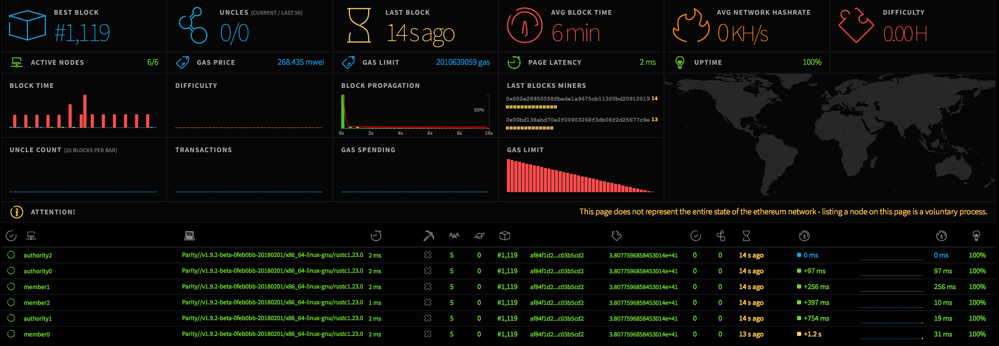

# Ethereum Development Environment and Network (EDEN) 

Developed with :green_heart: by [MaibornWolff](https://www.maibornwolff.de/) 

## What is EDEN exactly?

**E**thereum **D**evelopment **E**nvironment and **N**etwork is a collection of tools and templates to enable App developers to create new prototypes fast and effectively. 

**Contents:**

* Private “proof-of-work” Blockchain (2x Geth) + EthStats Dashboard

* Private “proof-of-authority” Blockchain (6x Parity) + EthStats Dashboard

* “Toolbox” with Truffle, Oyente and some Utils

EDEN is continuously updated, feel free to send pull requests!

## Download

The latest version will always be available in the master branch.

## Quickstart Guide

Refer to the README files in the subfolders for instructions. Have fun! :) 

## Feature request / Bug / Feedback

Have a bug, a feature request or any question? [Please open a new issue](https://github.com/MaibornWolff/codecharta/issues). Feedback is always welcome.

## License

see [LICENSE](LICENSE).